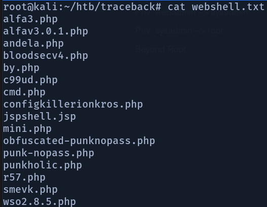
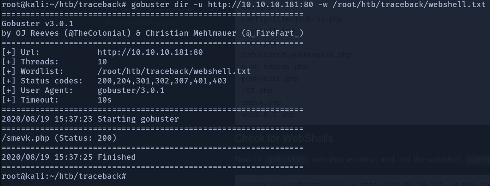
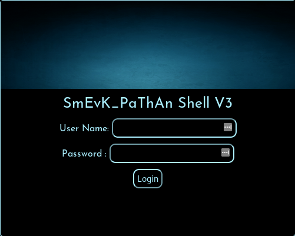
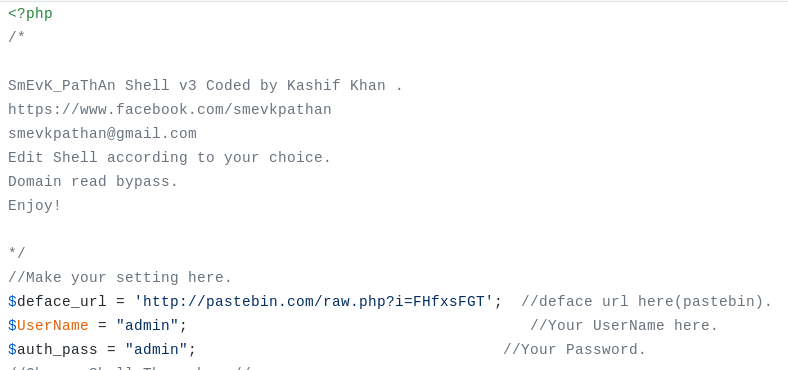
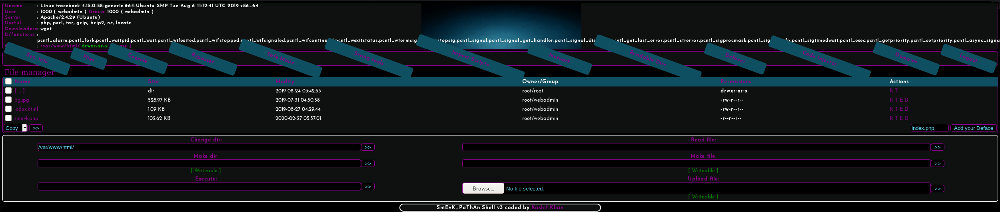

# Traceback Writeup

### A quick overview of the box


Traceback is a medium difficulty linux box with a difficulty rating of 4.4/10 at the time of writing.

In our journey to rooting the box we discover that a previous hacker has already compromised the server and in doing so has left a backdoor webshell for anyone lucky enough to discover it. From there we gain our initial user access on the server. To get to the next user we use Luvit which is a Lua interpreter as a pivot. From there we notice that there are some scripts being run as root whenever a user logs into the system. We will abuse this to gain root access on the machine.

### Recon

To recon the box we use a tool called Nmap. To do this we run the command:

```text
nmap -sC -sV 10.10.10.181
```

But what does this do? well from looking at the man page of the tool we can see that

| Command | Explanation |
| :---: | :---: |
| -sC | equivalent to --script=default |
| -sV | Probe open ports to determine service/version info |
| 10.10.10.181 | The IP address of the box to be scanned |

From this we can see that the above command used a tool called nmap to scan a IP address to try and determine any services being run and their versions and trying any default scripts that the tool knows against them.

#### Nmap Output:


Based on the Apache and OpenSSH versions shown, it would seem likely that the OS being run is an Ubuntu 18.04 bionic.

### Website - Port 80

upon navigating to the webserver http:/10.10.10.181:80 we are greeted with this page.


From here it is generally a good idea to look at the webpages source code so as to give ourselves a better idea as to what is going on. Quite often we can find credentials or hints hidden away in some of the top layer of pages on a website in challenges like this.

And so when we look at the source of the page we can see a html comment just below the message left by Xh4H.


At this stage we want to run a directory busting search to look for interesting and all files that might be on the server. To do this we use a tool called gobuster.

```text
gobuster dir -u http://10.10.10.181:80 -w /usr/share/wordlists/dirbuster/directory-list2.3-medium.txt
```

| Command | Explanation |
| :--- | :--- |
| gobuster | runs the tool called gobuster |
| dir | uses directory/file bruteforcing mode |
| -u | sets the target url |
| -w | sets the path to the word list to be used |

This search did not return any useful results but it was still good to run nonetheless.

While this was running I want and googled the html comment we found earlier.


Upon navigating ourselves into the GitHub repository we can see that it contains a list of common webshells. From here I created a wordlist containing all the names of the webshells listed in this repo and some others into a file called webshell.txt.



From here we can now rerun our gobuster scan but this time we can use our webshell wordlist to specifically search for the more popular webshells in the hope that we find the webshell left behind by Xh4H.

```text
gobuster dir -u http://10.10.10.181:80 -w /root/htb/traceback/webshell.txt
```

Quite quickly gobuster finds us a hit.



it would seem that the shell left for us to find was a smevk webshell.

### Getting a shell as Webadmin

visiting the path provided \(http://10.10.10.181:80/smevk.php\) gets us a login screen.



Generally the first thing to do when having found a login portal is to try default login credentials. And upon looking at the source code for the smevk webshell github we found are default credentials to log in with. \([https://github.com/TheBinitGhimire/Web-Shells/blob/master/smevk.php](https://github.com/TheBinitGhimire/Web-Shells/blob/master/smevk.php)\)



And so using admin admin to log into the web shell we are then greeted with a rather complicated looking webshell to server interface.



Now upon closer inspection this page tells us a LOT about the sever. For example it tells us that we are currently interacting with the server as webadmin. What software the server is running \(Apache 2.4.29\) as well as what software is installed and accessible by us. Those being php, perl, tar, gzip, bzip2, nc, and wget. 

